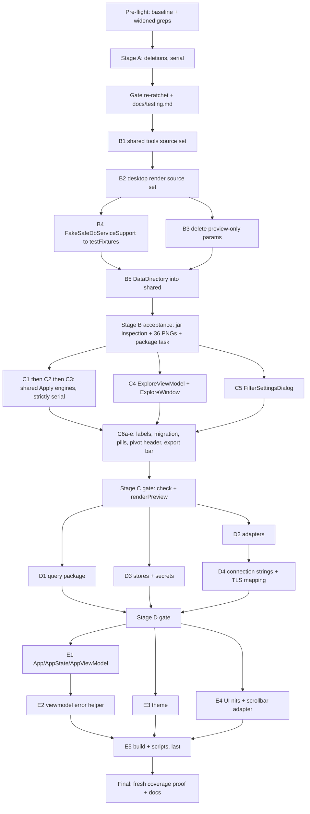

# safe-db simplification pass

Consolidate safe-db by deleting verified dead code, moving dev/test scaffolding out of the shipped
source sets, and collapsing the triplicated Explore primitives (bucketing, aggregation, number
formatting) into single shared implementations — fixing the three output divergences they have
already drifted into.

Five stages, ordered so each lands independently and `./gradlew check` stays green between them.
Behavior-changing work is confined to Stage C and E; Stages A, B, D are behavior-preserving except
where noted.

Baseline is commit `24c788c`. Working branch is `simplify/consolidation`.

## Pre-flight results

Measured before any edit:

- Desktop: 216 tests, 85.82% line coverage (floors 191 / 72%)
- Shared: 347 tests, 78.13% line coverage (floors 341 / 66%)

**The shared test floor has only 6 tests of headroom.** `SslErrorsTest.kt` alone is 6 tests, and
Stage A also removes cases from `ConnectionPresetsTest`, `SecretsTest`, and `CanvasGeometryTest`.
`minimumSharedTests` must therefore be lowered in the *same commit* as the deletions, not at the
stage boundary, or `check` fails mid-stage.

Widened deletion greps (whole repo, excluding `*.kt`) returned no matches for any deletion
candidate, so no doc, script, or workflow references the symbols being removed.

Stage B acceptance evidence, captured now for later comparison — both currently return matches and
must return nothing when Stage B is done:

```sh
unzip -l build/libs/safe-db-0.0.1.jar | rg -i 'tools/|Fake'
unzip -l shared/build/libs/shared-0.0.1.jar | rg -i 'tools/|Fake'
```

## Cross-cutting constraint: the verification gates will fight the deletions

Three checked-in floors in `build.gradle.kts` must be re-ratcheted as tests are deleted or code
moves between modules:

```kotlin
minimumDesktopTests.set(191)
minimumSharedTests.set(341)
// ...
coverageFloors.set(mapOf("desktop" to 72, "shared" to 66))
```

- Deleting `SslErrorsTest.kt`, `ConnectionPresetsTest` label cases, `joinEdgePointsHonorResizedTableWidth`,
  and the `panBy` assertion drops the counts below the shared minimum.
- Moving `tools/` out of `main` removes `com.safedb.tools.SeedMysql*` from the Kover include list and
  makes the `RenderPreview*` exclude dead.

**Correction found during Stage B:** moving a file between modules does *not* move its coverage
between buckets. `VerifyCoverageRatchet` assigns the `desktop` / `shared` bucket from the **package
name** in the aggregate Kover XML — `com/safedb` plus `com/safedb/(platform|export|viewmodel|ui)` are
`desktop`, everything else is `shared` — not from the Gradle module. So relocating
`com.safedb.platform.DataDirectory` from `src/` to `shared/` left both percentages untouched. Test
*counts* do move between modules, because those come from each module's own JUnit XML. Only a package
rename would move coverage.

Re-measure and adjust these once per stage rather than guessing. `docs/testing.md` restates the same
four numbers in prose and must be edited in the same commit every time.

---

## Stage A — Delete verified dead code

Each item was confirmed to have zero production callers by grep. No behavior change.

**Whole files / features**

- `shared/src/main/kotlin/com/safedb/connection/SslErrors.kt` (97 lines) and its 133-line test.
  `ConnectionErrorKind` appears only in those two files. The UI carries its own mode copy in
  `src/main/kotlin/com/safedb/ui/TransportSecurityOptions.kt`.
- `SecurityLabel`, `SecurityTone`, `securityLabelForMode` in
  `shared/src/main/kotlin/com/safedb/connection/ConnectionPresets.kt` plus their test cases. Keep
  `DIALECTS`, `isLocalHost`, `inferLocation`, `transportPresetForLocation` — all live.
- `src/main/kotlin/com/safedb/platform/LegacyDataImport.kt`. `candidateDirs()` returns a one-element
  list, so `resolveDataDir()` is unconditionally `DataDirectory.resolve()`. Point `Main.kt` at
  `DataDirectory.resolve()` and drop the multi-candidate test.
- The Explore user-template extension point in `src/main/kotlin/com/safedb/ui/ExploreTemplates.kt`:
  `ExploreTemplateCatalog`, `userTemplates()`, the unreachable `user` mapping block, `isUserTemplate`,
  and the defensive `filterNot` in `BuilderRecipesUi.kt` and `ExploreRecipesUi.kt`. Also drop the
  `sample: QueryResult` parameter threaded through `resolveExploreTemplate` → `build` — no builder
  body reads it.

**Unbound credential API** — delete `passwordForConnection`, `savePassword`, `getPassword` from
`SecretsManager.kt` and move `SecretsTest` onto the bound `passwordForDefinition` /
`savePasswordForDefinition` pair. This makes the endpoint-binding guarantee structural: today a
caller reaching for the shorter name silently opts out of the fingerprint check. Keep
`deletePassword` — it is used by `SafeDbServiceImpl`.

**Members and parameters**

- `validationBlocked` parameter and its `"validation_block"` branch in `QueryRiskGate.kt`. All 3
  production and 11 test call sites pass two arguments.
- `QueryRiskEvaluation.assessment`, `QueryError.RiskGate.decision`, `QueryError.RiskGate.assessment` —
  no property access anywhere.
- `Operation.compatible` in `QueryRiskStatic.kt` — never set, discarded positionally.
- `HistoryEntry.riskOptimizerCostThreshold` in `Queries.kt` — persisted, never written.
  `ignoreUnknownKeys = true` makes removal safe for old files.
- `joinEdgePoints` / `JoinEdgePoints` in `CanvasGeometry.kt` — the live path is `routeJoinEdge`.
  Keep `columnY`.
- `CanvasViewportState.panBy` and `SchemaMapViewModel.panBy` — the map uses
  `updatePan(canvasConstrainedPan(...))`.
- The three zoom/inset aliases in `SchemaMapViewModel.kt`; import `CANVAS_MIN_ZOOM`,
  `CANVAS_MAX_ZOOM`, `CANVAS_DEFAULT_PADDING` directly.
- `EstimatedRowBand` / `estimatedRowBand` → `internal` (referenced only within `QueryRiskPlan.kt`).
- The 8 overrides in `RecipesViewModelTest.kt` that restate `FakeSafeDbServiceSupport` defaults
  verbatim.
- `DEFAULT_PORTS` in `ParseConnectionString.kt` — derive from `DIALECTS` instead.

**One-line hardening** — drop `by delegate` from `DispatchingSafeDbService.kt`. It overrides all 20
methods already, so the clause contributes nothing today but would silently forward a 21st method
undispatched onto the Compose thread.

**Deferred out of Stage A during orchestration** (see the collision map): the Explore-local
byte-identical duplicates (`escapeGroupPath`, `formulaReferences`, `sumDecimals`, the
`decimalOrNull`/`text` aliases, `chooseCsvFile`) move to Stage C, because C1–C3 rewrite those exact
functions and doing them twice is pure churn. The `MysqlFixtureGenerator` shim moves to Stage B,
which relocates the whole `tools` tree anyway.

---

## Stage B — Get dev/test scaffolding out of the shipped source sets

Verified by inspecting the built jars: `shared-0.0.1.jar` contains `SeedMysql`, `SeedRelational`,
`RelationalFixtureGenerator` and `FakeSafeDbServiceSupport`; `safe-db-0.0.1.jar` contains
`RenderPreviewKt` and a 22 KB `FakeService`. There is no minification step, and
`targetFormats(TargetFormat.Dmg, TargetFormat.Msi)` bundles them.

The seeders are the sharp edge: `SeedMysql.kt` runs `DROP DATABASE IF EXISTS`, and both seeders
truncate the end user's real `connections.json` and `query_history.json`.

Use the existing `integrationTest` pattern in `shared/build.gradle.kts` as the template — it already
solves both the `main` output dependency and `internal` visibility via `friendPaths`.

1. **`shared` tools source set.** Create `sourceSets.create("tools")` with
   `compileClasspath += main.output`, `runtimeClasspath += main.output`, and `friendPaths` from
   `compileKotlin`. Move `shared/src/main/kotlin/com/safedb/tools/` and `SeedMysqlTest.kt` into it.
   Repoint the four seed `JavaExec` tasks at the new output instead of the shared jar. Remove
   `"com.safedb.tools.SeedMysql*"` from the Kover includes. Fold the 7-line `MysqlFixtureGenerator`
   shim into `RelationalFixtureGenerator` while the files are moving.
2. **Desktop render source set.** Same shape for `src/main/kotlin/com/safedb/tools/`
   (`RenderPreview.kt`, `RenderThemeGallery.kt`). Repoint `renderPreview` and `renderThemeGallery`
   off `sourceSets.main.runtimeClasspath`, and delete the now-dead Kover exclude. Prefer a dedicated
   source set over `src/test` because `qodana.yaml` excludes `src/test` from all inspections.
3. **Drop the preview-only parameters.** With the tool out of `main`, delete
   `initialSidebarCollapsed`, `newConnectionPreview`, `editConnectionPreview` from `AppShell.kt`, the
   threading into `ConnectionsScreen`, and the initial-state capture there. `App.kt` never sets them.
4. **`FakeSafeDbServiceSupport` → test fixtures.** Add `java-test-fixtures` to `:shared`, move it to
   `shared/src/testFixtures`, and add `testImplementation(testFixtures(project(":shared")))` to the
   desktop module plus the new render source set.
5. **Unify `DataDirectory`.** Move `DataDirectory.kt` to `shared/src/main/kotlin/com/safedb/platform/`,
   next to `DesktopPlatform` it already depends on. Delete `safeDbAppDataDir` and
   `SeedMysqlPlatformEnvironment` from `SeedMysqlEnvironment.kt` — a field-for-field copy — and merge
   the duplicated path assertions across `PlatformPathsTest.kt` and `SeedMysqlTest.kt`. Keep the
   null-returning wrapper in the tools layer: `baseDir()` throws when `APPDATA` is unset, and
   `safeDbAppDataDirForStateReset` relies on getting null so it can skip the reset with a message.

Verify: `./gradlew check`, then `./gradlew renderPreview renderThemeGallery` and confirm the 36-PNG
gate in `.github/workflows/durability.yml` still passes.

---

## Stage C — Collapse the triplicated Explore primitives

This is the actual architectural consolidation. `ApplyExplore`, `ApplyWorksheet`, and
`ApplyVisualization` each own a private copy of the same primitives, and they have drifted. Fixing
the divergences is part of unifying.

**C1. One number formatter.** Three implementations of `PivotNumberFormat` rendering, in
`ApplyExplore.kt`, `ApplyVisualization.kt`, and `ExploreWorksheetCalculations.kt` — the last in the
UI module, which is the one place pure logic should not live. Add
`formatExploreNumber(value: BigDecimal, format: PivotNumberFormat): String` to a new
`shared/src/main/kotlin/com/safedb/explore/ExploreFormat.kt` and have all three call it. Keep
`formatPivotCell`'s `Auto`→`Percent` inference and the UI's null/error presentation at their own call
sites. Fixes: Scientific renders `1.23E3` not `1.23e+03`; currency uses locale-correct symbol
placement via the `¤` pattern rather than an unconditional prefix; large `IntegerCell` values stop
round-tripping through `Double`.

**C2. One aggregator.** `computeMeasure` and `ApplyVisualization.aggregate` both switch over the same
12-value `MeasureFn`, and two branches disagree. The chart's `Min`/`Max` operate on a list filtered to
decimal-parsable cells, so on a date or text column they return `null`, the mark is dropped, and the
user sees "No plottable values were found." The pivot uses
`comparableCells(rows, index).minWithOrNull(::comparePivotCells)` and works. This is reachable:
`availableMeasureFunctions` offers Min/Max for `Date`, `DateTime`, `Text`, and `Bool`. `Avg` also
disagrees — `divide(size, 8, HALF_UP)` versus `MathContext.DECIMAL128`. Extract
`aggregateMeasure(cells, fn)` into shared and delete both verbatim copies of `statistic`. Leave
`WorksheetAggregateFn` alone — collapsing it into `MeasureFn` is a serialization change and a
separate decision.

**C3. One bucketer.** Each engine has its own `bucket`/`dateBucket`/`numberBucket` trio plus its own
private bucket type, differing only in the third field (`sortKey: String` / `sortValue: ResultCell` /
`numeric: Double?`). The `DateGroupUnit` five-way branch, quarter arithmetic, and `NumberBin`
floor-divide are copied verbatim. Two date parsers back them — `parseDateTime` trims,
`parseExploreDate` does not — so a whitespace-padded value groups correctly in the pivot and becomes
"(invalid date)" elsewhere. Extract
`groupingBucket(cell, grouping, label): ExploreBucket(key, label, ordinal: BigDecimal?)` into a new
`ExploreGrouping.kt`, let each engine derive its sort representation from `ordinal`, unify on the
trimming parser, and delete `ExploreValues.kt`.

Important: **keep the pivot's existing bucket key strings as canonical**, including the unpadded
`"$weekYear-W$week"` form. Keys are persisted inside `collapsedRowPaths` / `collapsedGroupPaths`, and
adopting the worksheet's `%04d-W%02d` form would orphan saved collapse state — a regression, not a
fix.

**C4. `ExploreViewModel` state and dispatch.**

- Six properties encode three facts: `preview`/`worksheetPreview`/`visualizationPreview` are always
  exactly the `.value` of the three `PreviewState` wrappers. `PreviewState.value` and `.error` are
  never read anywhere; only `.loading` is, at 8 sites. Replace the three wrappers with a
  `Set<ExploreMode>` exposed as `isLoading(mode)` and delete `PreviewState`.
- The captured-but-never-displayed compute errors are the more serious half: if `applyExplore`
  throws, the UI keeps showing the stale preview with no indication. Surface them in the existing
  warning surface — treat that as the point of the change.
- `refreshMode` and `computeModeNow` implement the same three-way dispatch twice, ~94 lines for one
  parameterized operation. Give the existing private `PreviewTask` its compute lambda and result
  setter, build the three instances once, and both become a map lookup. Preserve the generation guard
  exactly.

**C5. `FilterSettingsDialog`** (the largest function in the subsystem, ~284 lines). It flattens the
`PivotFilter` sealed hierarchy into nine `remember` slots with `as?` casts and reassembles via a
four-branch `when`; only 2–4 slots are meaningful at a time and nothing says which. Lift them into
one `FilterDraft` with `from(PivotFilter)` / `toFilter()`, held in a single `remember(filter.id)`. Pin
the round-trip with a test first — that will also document the `pinned` inconsistency (edited only
under `Members`, written into `Label` on save, hardcoded false for `Value`/`TopN`) so it can be
resolved deliberately. Then extract the member-list block.

**C6. Smaller Explore items** (split into five commits: a labels, b migration, c pills, d pivot
header, e export bar).

- `PivotLeafHeaderRow` recomputes inline what `pivotSortTarget` / `pivotLeafLabel` exist to do; those
  helpers currently have only test callers. Swap, but move the order-dependent-`showAs` guard into
  `pivotSortTarget` or the header will start offering sort on running-total measures.
- Four `MeasureFn` → label mappings that have already drifted (`StdDev` is "Standard deviation",
  "StdDev", and "StdDevP" depending on the site). Put `shortLabel` and `label` on the enum in
  `shared`; delete `measureFunctionName` and the inline block in `measureFor`.
- Validate `ExploreConfig.schemaVersion` at decode the way `RecipeStore.kt` already does, migrate the
  legacy `columnDimension` into `columnDimensions` once at that boundary, then delete the field,
  `effectiveColumnDimensions`, and the six scattered `columnDimension = null` writes. Needs a decode
  test with a real v1 payload — do not delete the six nulls without the migration.
- Delete `SelectPill`, `ChoiceChip`, `RecipePill` (one-line pass-throughs) and replace `ChoicePill`
  with `SelectablePill`. `ChoicePill`'s border is a static `outline` regardless of selection, so
  pivot-settings pills currently don't show the selection border other Explore pills do — this is a
  visual fix.
- Extract the identical export-bar preamble in `ExploreWindow.kt` into one composable with a
  trailing-actions slot, and absorb the Explore-local duplicate helpers deferred from Stage A.
- Unify `dateUnitLabel` ("ISO week") with `groupingLabel` ("Iso week").

Verify: extend the existing date-grouping tests in `ApplyExploreTest` / `ApplyWorksheetTest` /
`ApplyVisualizationTest` to assert all three engines bucket identically; add a test asserting pivot
and chart agree for every `MeasureFn` on a mixed-type column. Run `./gradlew renderPreview` — C1 and
the pill change are visual.

---

## Stage D — Query, adapter, store, secrets consolidation

Behavior-preserving except where noted for stores.

**Query**

- Extract the shared "validate, then assess unless the gate is disabled" step. `QueryRisk.kt` and
  `QueryCore.kt` re-derive it independently — one feeds the builder's risk preview, the other gates
  execution, so drift shows up as a preview that disagrees with Run. The helper must return
  `validated`, `normalizedSpec`, and the warnings, not just the assessment, or the execution path
  loses warnings.
- Drop the hand-maintained `paramIdx` from five WHERE-building signatures in `CompileHelpers.kt`; it
  is always `params.size + 1`. Well covered by the per-dialect placeholder tests.
- Retire the test-only `compile()` overload and the `validatedColumns == null` projection branch. All
  26 callers are in `QueryEngineTest`; production only uses `compileValidated`, which always emits
  aliases. Note `emptyColumnsSelectStar` asserts output `compileValidated` can never produce.
- `ValidationOutcome.limit` duplicates `normalizedSpec.limit` assigned four lines earlier; read the
  spec in `executeCompiled`.
- Dedupe `tablesByAlias` (identical in `QueryRiskStatic.kt` and `QueryRiskPlan.kt`) and the join
  display label (4 spellings, plus a fifth convention for `AdditionalJoinedRelation`). Preserve the
  exact label strings — they reach the UI.
- Have `validateLiteral`'s `Bool` branch delegate to `parseBoolLiteral` instead of re-listing the
  seven accepted spellings; keep the column-qualified error message.
- `HydrateQuery.kt` hard-codes the `\u0000` delimiter that `ColumnKeys.kt` defines as
  `COLUMN_KEY_SEP`.
- `filterLeafIdAtPath` delegates to `filterNodeIdAtPath` for non-empty paths; promote `nodeId` from
  `QueryRiskPredicate.kt` to a shared helper and delete `childId` plus the inline third copy.
- File hygiene: fold `evaluateQueryRisk` into `QueryRiskGate.kt` and move `queryFingerprint` next to
  `ValidatedQuery`, retiring `QueryRisk.kt`; rename `CompileHelpers.kt` → `CompileClauses.kt` and
  `ValidateHelpers.kt` → `ValidateFilters.kt`; extract `quote` / `placeholder` / `buildIlike` into
  `SqlSyntax.kt` so the compiler reads as dialect-neutral clause assembly. Do **not** push dialect
  branching into the adapter layer — the compiler has no adapter instance and `Adapter` owns pools,
  not SQL text.
- Add the missing test where two static signals share one `RiskTarget.Access(alias)`, since plan
  refinement collapses all of them into at most one replacement and nothing pins that. Move the two
  plan-refinement tests out of `QueryRiskTest` into `QueryPlanRefinementTest` where the fixtures live.

**Adapters** — add `foreignKeyRow`, `columnRow`, `tableSizes`, and `probeVersion` helpers to
`SchemaMetadata.kt` / `JdbcHelpers.kt` and add `AS` aliases to MySQL's foreign-key query so all four
adapters share one call. Removes ~120 lines. Keep every per-dialect SQL string, both index mappers,
all `IndexCapabilities` values, and every `executeQuery` / `explain` body — the read-only transaction
and timeout mechanisms differ fundamentally, and the MSSQL pool reset and Oracle `PLAN_TABLE` cleanup
are necessary. These mappers are only exercised by `shared/src/integrationTest`, so land one adapter
per commit and run the integration suite per engine.

**Stores** — switch `ConfigStore.loadConnectionsUnlocked` / `writeAllUnlocked` to `readJsonList` /
`writeJsonList`. Today `connections.json` is the only store without corruption quarantine: it calls
`.jsonArray` directly, so a malformed file makes `listConnections()` fail on every call with no
self-heal, while saved queries and recipes quarantine to `<name>.corrupt-<uuid>.json` and continue.
This changes observable behavior for a corrupt file (renamed aside, one descriptive error) — mirror
the existing quarantine test in `StoreTest.kt`. Optionally lift the shared migrate-backup-rewrite loop
into `JsonListStorage`.

**Secrets** — replace the character-identical `MacCredentialStore` and `WindowsCredentialStore` with
one `PlatformCredentialStore` that derives the warning text and label from `DesktopPlatform`. Keep the
label strings byte-identical and preserve the fallback-to-memory warning — it is the only signal a
user gets that credentials aren't reaching the OS keychain.

**Connection strings** — share the Postgres and MySQL TLS mode mappings between `JdbcHelpers.kt` and
`ParseConnectionString.kt` (currently written twice; the SQL Server pair has already drifted on
`hostNameInCertificate`). Leave the SQL Server property mapping split — connecting and displaying
genuinely need different property sets; add a comment saying so. Extract one `sqlServerResult` helper
for the ~90% identical `parseSqlServerJdbc` / `parseSqlServerKeyValue`, keeping the two key-alias
lists as parameters since their order differs. Do not otherwise restructure this file — despite 786
lines it funnels correctly through one URL tokenizer, one semicolon tokenizer, and one `baseResult`
validation gate.

---

## Stage E — App, viewmodel, theme, UI, build

- **`AppState`** — drop the unused `service` parameter; nothing in the class touches it and it exists
  only so `App.kt` can read it back. Thread the service alongside instead, and delete the
  `java.lang.reflect.Proxy` in `AppStateTest.kt` that exists solely to satisfy it.
- **Pending-recipe state machine** — move the 23-line `when` in `App.kt` into a single
  `AppViewModel.onQuerySettled(...)`, collapsing the three narrow methods and the
  `shouldCancelPendingRecipeOnQuerySettle` free function that was hoisted out purely so the
  composable's branch could be unit-tested. Keep the `LaunchedEffect` as a thin trigger; do not
  reorder the branches. This governs when an Explore window opens after a recipe run, not query
  gating.
- **Dispatcher forwarding** — `AppViewModel(service, ioDispatcher)` looks like full dispatcher control
  but doesn't reach `RecipesViewModel` or `ExploreViewModel`, both of which declare their own
  defaults. Forward it. Expect a couple of `advanceUntilIdle` / `runCurrent` adjustments once those
  paths stop hitting real IO.
- **Viewmodel error boilerplate** — three idioms do one job: `try/catch (Exception)` without a
  cancellation rethrow (7 sites), with one (4 sites), and `runCatching` which catches `Throwable`
  including cancellation (5 sites). Add one `capturingFailure` helper that rethrows
  `CancellationException`, and normalize the 7 + 5 onto it. Leave `SettingsViewModel` (mutex/generation
  logic) and `QueryViewModel` (its `QueryFailureException` branch) alone. Only visible impact today is
  at teardown, which is why this is last.
- **Theme** — express Control Blue as a fourth `ThemePaletteSpec` and delete the 275 lines of loose
  vals plus two hand-written scheme builders in `Color.kt`, and the
  `error("Control Blue uses the established palette in Color.kt")` that makes `paletteSpecFor` a
  total-looking function which crashes on one of four enum inputs. The naive collapse shifts 4 light
  and 8 dark Material slots; most are unreferenced (`secondary`, `onSecondary`, `inversePrimary` have
  zero uses), but dark `primary` `0xFF6EA2FF` → `0xFF4C8DFF` against white `onPrimary` is ~3.2:1 and
  weakens icon contrast in `TableCard.kt`. Add optional `materialPrimary` / `onMaterialPrimary` fields
  to the spec so dark Control Blue is preserved exactly.
- **Dialogs** — add `DialogShape` to `Shape.kt` and replace the 13 hard-coded `RoundedCornerShape(4.dp)`
  sites. Replace the hand-rolled confirm dialog in `BuilderScreen.kt` with the existing `ConfirmDialog`
  (20 lines → ~8); expect the message to pick up `bodyMedium`.
- **Duplicate scrollbar adapter** — `BuilderCanvasScrollbarAdapter` and `SchemaMapScrollbarAdapter`
  differ only in the class name. Move one copy to `CanvasViewport.kt`, which already owns
  `CanvasAxisScrollState`. Do **not** unify the surrounding wiring — the builder's half-viewport
  padding, scrollbar-bounds tracking, and top-inset offset are real differences.
- **File nits** — inline `FilterBuilder.kt` (a 6-line pass-through with one caller) into
  `FilterGroupCard.kt`; rename `UiLabels.kt` (contains only `dialectLabel`) to `DialectLabel.kt`; make
  `Kbd` internal.
- **Build/scripts** — have the three identical `seed_{postgres,mssql,oracle}.sh` wrappers exec a shared
  `scripts/seed_relational.sh <dialect> "$@"`, keeping the four documented script names. Move
  `splitSeedMysqlArgs` (28 lines of hand-rolled quote parsing, MySQL-named but used by all four
  dialects) from `build.gradle.kts` into `buildSrc` where it can be tested; that may also let the two
  `qodana.yaml` string-escaping suppressions go. Do not switch to `JavaExec --args` — that changes the
  documented `-PseedPostgresArgs` interface.

---

## Explicitly out of scope

- **Do not split the large files.** `ExploreWorksheet.kt`, `SchemaMapScreen.kt`, `Canvas.kt`,
  `QueryViewModel.kt`, and `AppShell.kt` are long but well-decomposed into named single-purpose
  functions. `AppShell.kt` has exactly one `LaunchedEffect` and it is sidebar animation; the repo has
  zero `snapshotFlow` uses.
- **Do not extract `QueryViewModel`'s run lifecycle.** `invalidateSettledRunFailure()` is called from
  28 sites, and `canRun` would have to be re-derived across the new boundary — a large subtle change
  to the confirmation and risk-blocking path.
- **Do not split `SafeDbService`.** 20 methods, but one real implementation and one decorator;
  splitting it multiplies both plus the seven fakes.
- **Do not merge `SchemaMapPoint` into `CanvasPoint`.** They carry different units (dp vs px); the
  separate types are what stop dp values from reaching px math.
- **Do not introduce a spacing token scale.** ~900 `.dp` literals; large mechanical migration with no
  behavior improvement.
- **Do not consolidate the four query-test fixture builders** or the two `ThemePaletteTest` files —
  the latter test different layers (persistence contract vs Compose scheme resolution and contrast).
- **Do not move the root `testdata_*.sql` files.** Load-bearing from `compose.yaml`, three docker init
  scripts, two seeders, and `durability.yml`.

---

# Execution orchestration

## Ground rules

1. **One Gradle process per checkout.** The wrapper takes a project-wide lock, so two workers must
   never build in the same working directory. Parallel work happens only in isolated `git worktree`
   checkouts, and each of those pays a cold Kotlin/Compose build. That tradeoff is only worth it for
   the large disjoint clusters called out below; everything else runs sequentially in the main
   checkout with a warm daemon and incremental compilation.
2. **Never trust line numbers after Stage A lands.** Every citation was captured against `24c788c`.
   Each worker re-greps for the symbol it is about to change and works from what it finds.
3. **One commit per work package**, on a single branch. A stage boundary is a full `./gradlew check`
   plus a tag, so any stage can be reverted as a unit.
4. **Workers own a file set, not a feature.** The scope line for each package is a hard boundary — a
   worker that needs to touch a file outside its set stops and reports instead of widening.
5. **Behavior-preserving unless the package says otherwise.** Only C1, C2, C3, C4, C6c, D-stores, and
   E-theme may change observable output, and each states exactly how.

## Sequencing



## File-collision map — why the order above is what it is

These constraints are not obvious from the plan body and a naive parallel run would break them:

- **B2 must precede B4.** `RenderPreview.kt` consumes `FakeSafeDbServiceSupport`. While it still lives
  in `src/main`, it cannot depend on `testFixtures(project(":shared"))` — main source sets can't. Move
  the tool out of `main` first, then move the fake into fixtures and point the new source set at it.
  Doing B4 first breaks the build.
- **B3 depends on B2.** The three preview-only parameters can only be deleted once their sole caller is
  out of `main` and rewired.
- **B1 and B5 both edit `SeedMysqlEnvironment.kt`** (B1 relocates it, B5 guts it). Serialize; B1 first
  so B5 edits the file in its final home.
- **C1, C2, and C3 all edit `ApplyExplore.kt` and `ApplyVisualization.kt`.** Strictly serial, in that
  order — formatting is smallest and lowest-risk, aggregation next, bucketing last because it is the
  one with persisted-state implications.
- **C4 (`ExploreViewModel.kt`, `ExploreWindow.kt`) and C5 (`ExploreSettingsDialogs.kt`) are disjoint**
  from C1–C3 and from each other. These are the parallel opportunity in Stage C.
- **C6 collides with almost everything in Stage C**, hence last and split five ways. C6a and C6b both
  touch `ExploreModels.kt` — serialize those two.
- **D2 and D4 both edit `JdbcHelpers.kt`** (D2 adds `probeVersion`, D4 shares the TLS mode mappings).
  Serialize D2 → D4, or hand both to one worker.
- **D1, D2, and D3 are fully disjoint** (`query/` + `model/`, `adapter/`, `store/` + `secrets/`). Best
  parallel opportunity in the plan — three worktrees, three independent test subsets.
- **E1 forwards a dispatcher into `RecipesViewModel`'s constructor**, which E2 is also rewriting.
  Serialize E1 → E2.
- **E3 (theme) and E4 (UI nits) are disjoint** from E1/E2 and each other — parallel.
- **E5 edits `build.gradle.kts`, which every gate re-ratchet also edits.** Last, alone.

## Verification ladder

Cheapest to most expensive; a worker climbs only as far as its package requires.

- Per edit: `./gradlew compileKotlin :shared:compileKotlin`
- Per package: a targeted `--tests` filter
- Per stage: `./gradlew check`
- Visual packages (C1, C6c, E3, E4): `./gradlew renderPreview --rerun-tasks`, plus
  `renderThemeGallery` for E3
- Build-logic packages (B1, B2, B4, E5): `./gradlew help` first, since a configuration error there
  fails everything downstream
- Adapters (D2): `./gradlew integrationTest`, engine-gated
- Final: `./gradlew check koverXmlReport koverVerify --rerun-tasks --no-build-cache`

## Known risks to watch during execution

- **The gate numbers will drift three or four times.** Re-ratchet at every stage boundary, always from
  measured XML, and update `docs/testing.md` in the same commit. Never carry a guessed number forward.
- **Coverage floors can move in the wrong direction.** Stage A deletes both code and tests; Stage B
  moves ~2,600 lines out of the measured source sets. A floor that rises artificially will block a
  later legitimate change.
- **Stage C is where a real regression could hide.** The three divergence fixes are intentional
  behavior changes, so a broken unification looks like an intended one. The cross-engine equivalence
  tests are the actual safety net — write them as part of C1/C2/C3, not afterwards.
- **Persisted state cannot be walked back**: bucket keys inside collapsed-path sets (C3), the
  `ExploreConfig` v1 migration (C6b), and the corrupt-file quarantine rename (D3). Each needs its own
  test before the change lands.
- **Do not let a worker widen scope.** The highest-value outcomes are that `shared/` stops containing
  destructive database tooling and the Explore engines stop disagreeing with each other. Everything
  else is cleanup and can be dropped if a package turns out larger than described.
