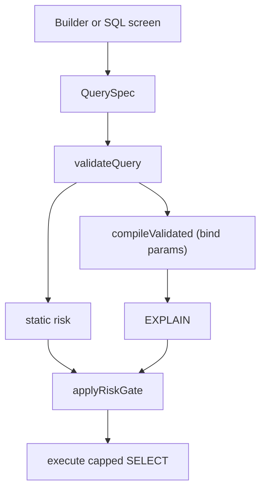

# Query engine

This is the contract for [`runQueryCore`](../shared/src/main/kotlin/com/safedb/query/QueryCore.kt). Read it before changing the parser, validator, compiler, risk gate, or a JDBC adapter. User-facing product docs live at [https://www.safe-db.dev/docs](https://www.safe-db.dev/docs).

## Pipeline

Builder and SQL screen both produce a [`QuerySpec`](../shared/src/main/kotlin/com/safedb/model/Ir.kt). Typed SQL is parsed in [`SqlToSpec.kt`](../shared/src/main/kotlin/com/safedb/query/sql/SqlToSpec.kt); the original text is not sent to the database.

[`compileValidated`](../shared/src/main/kotlin/com/safedb/query/Compile.kt) emits dialect SQL with bind parameters. The compiled fetch size is `limit + 1` so the UI can tell a hit cap from an exact row count.

## Accepted SQL

A single `SELECT`. Columns are real schema columns (or `table.*`), not expressions.

- `INNER JOIN` on column equality only (`a.x = b.y`). Each join column must be the leading key of an equality-capable index, or the join must be a complete foreign key ([`Validate.kt`](../shared/src/main/kotlin/com/safedb/query/Validate.kt)).
- Filters, including nested groups, up to `MAX_FILTER_DEPTH`.
- Optional `DISTINCT`, `GROUP BY` of columns, `ORDER BY`, and `LIMIT` (SQL Server `TOP`; Oracle `FETCH FIRST`).

## Rejected SQL

User-facing reasons live in [`SqlMessages.kt`](../shared/src/main/kotlin/com/safedb/query/sql/SqlMessages.kt). The parser rejects:

- Writes and anything that is not `SELECT`
- Multiple statements
- CTEs (`WITH`)
- Subqueries
- Outer joins
- `UNION` / `INTERSECT` / `EXCEPT`
- `HAVING`
- `OFFSET`
- Column aliases
- Functions and SQL-level aggregates (`COUNT`, `SUM`, …)
- Expressions and calculations in the select list
- Optimizer hints (`/*+ … */`)
- MySQL executable comments (`/*! … */`)
- National string literals (`N'…'`)
- Comparing two columns in a predicate

Aggregates belong in Explore, on the sample already fetched.

## Limits

Numbers are the constants, not copy. Change the constant and update this page in the same change.

| Constant | Value | File |
| --- | --- | --- |
| `DEFAULT_LIMIT` | 500 rows | [`Validate.kt`](../shared/src/main/kotlin/com/safedb/query/Validate.kt) |
| `MAX_LIMIT` | 10,000 rows | [`Validate.kt`](../shared/src/main/kotlin/com/safedb/query/Validate.kt) |
| `LARGE_LIMIT_WARNING_THRESHOLD` | 1,000 rows | [`Validate.kt`](../shared/src/main/kotlin/com/safedb/query/Validate.kt) |
| `MAX_IN_LIST_SIZE` | 1,000 values | [`Validate.kt`](../shared/src/main/kotlin/com/safedb/query/Validate.kt) |
| `MAX_FILTER_DEPTH` | 5 | [`Validate.kt`](../shared/src/main/kotlin/com/safedb/query/Validate.kt) |
| `DEFAULT_TIMEOUT_MS` | 10s query timeout | [`QueryCore.kt`](../shared/src/main/kotlin/com/safedb/query/QueryCore.kt) |
| `CONNECT_TIMEOUT_MS` | 10s connect timeout | [`JdbcHelpers.kt`](../shared/src/main/kotlin/com/safedb/adapter/JdbcHelpers.kt) |

Hikari `maximumPoolSize` is 1 and `isReadOnly` is true ([`JdbcHelpers.kt`](../shared/src/main/kotlin/com/safedb/adapter/JdbcHelpers.kt)).

## Risk gate

Settings are `Cautious`, `Standard`, `Flexible`, and `Disabled` ([`Settings.kt`](../shared/src/main/kotlin/com/safedb/model/Settings.kt)). [`applyRiskGate`](../shared/src/main/kotlin/com/safedb/query/QueryRiskGate.kt) blocks from `Elevated` for `Cautious`, `High` for `Standard`, and `VeryHigh` for `Flexible`; `Disabled` has no blocking threshold.

A missing plan or a missing/invalid optimizer cost returns [`QueryError.ConfirmationRequired`](../shared/src/main/kotlin/com/safedb/query/QueryCore.kt) rather than running. A high but finite cost does not. `Disabled` turns off descriptive scoring; `EXPLAIN` still runs as an execution safeguard.

## Adapters

| Dialect | Session | Trust |
| --- | --- | --- |
| PostgreSQL | `SET TRANSACTION READ ONLY, ISOLATION LEVEL READ UNCOMMITTED` | Verified TLS keeps pgjdbc trust and client certificates unless a launch profile is set. |
| MySQL | `SET TRANSACTION READ ONLY, ISOLATION LEVEL READ UNCOMMITTED` | JVM trust, or a launch-profile PKCS12 store. |
| SQL Server | `SET TRANSACTION ISOLATION LEVEL READ UNCOMMITTED` and `SET LOCK_TIMEOUT`; no `SET TRANSACTION READ ONLY` | JVM trust, or a launch-profile PKCS12 store. |
| Oracle | `SET TRANSACTION READ ONLY` | Verified TCPS uses an Oracle wallet. A generic PKCS12 launch profile is not a substitute. |

Launch-profile schema, fail-closed startup, and the SSL harness are in [trust-stores.md](trust-stores.md).

## Explore and export

Pivot, worksheet, and visualization mutate an immutable sample, not the `QuerySpec`. CSV, chart PNG, and the HTML report carry the rows already fetched: no connection, credentials, or live query. Recipes store layout only; they can be imported on another machine without secrets or result rows.
